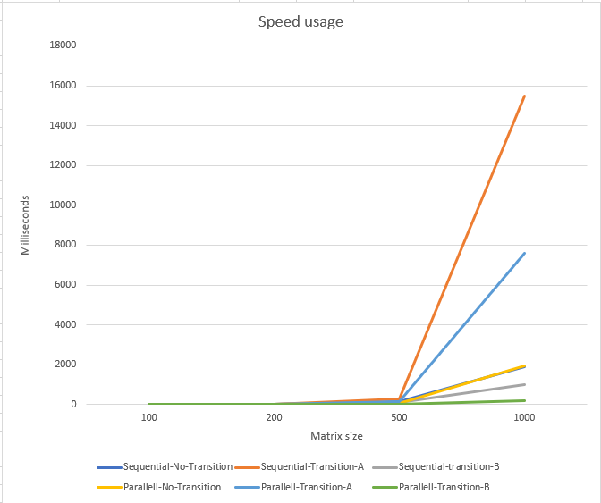
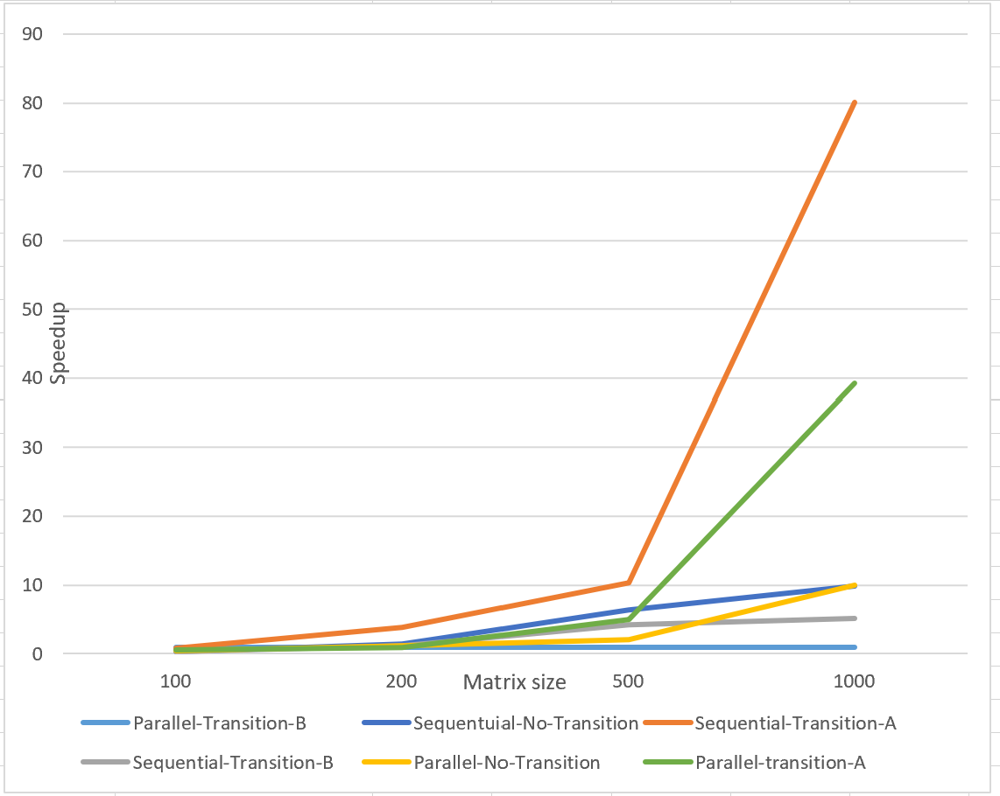
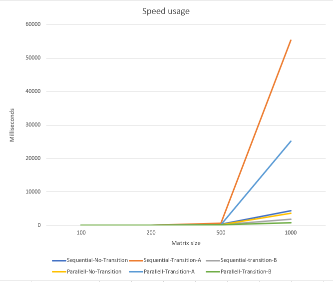
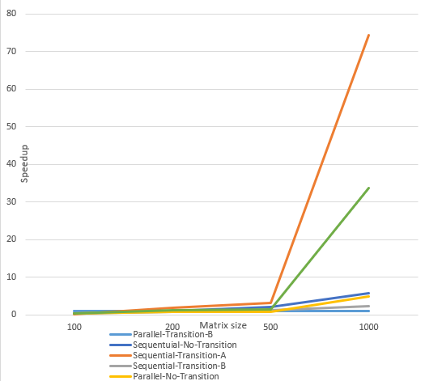

### Oblig 2 in UiO coarse 4030

#### Introduction
This program demonstrates the efficiency of creating a cache-friendly program. it demonstrates the delays due to cache misses and cache hits.
In order to demonstrate this behaviour, the task is about doing a matrix multiplication (https://www.mathsisfun.com/algebra/matrix-multiplying.html).
When iterating arrays for doing such operations, doing a row-wise iteration is much faster than column-wise iteration due to cache hits. In order to do row-wise calculation
however it's necessary to transpose table B as demonstrated in code.

#### Sequential Matrix Multiplication – short description
Tests for the sequential matrix multiplication can be found under /test/java/TestSequential.
It contains tests for matrix sizes: 100x100, 200x200, 500x500, and 1000x1000. The matrix multiplication runs sequential.
The tests also contains transition of either table A or table B and prints out the median speed of these approaches.


#### Parallel Matrix Multiplication – how you did the parallelization
Tests for the sequential matrix multiplication can be found under /test/java/TestParallel.
It also contains tests for the different matrix sizes: 100x100, 200x200, 500x500, and 1000x1000. All these tests runs in parallel.
These tests also contains transition of either table A or table B and prints out the median speed of these approaches.

In order to achieve parallelization for the matrix multiplication, my approach was to divide the reading of array based on
available cores on the host computer. So e.g if PC has 4 cores, and the matrix has 100 rows, each thread will calculate for 25 rows.
All threads can safely read from matrix A and matrix B (after transition) because these are no longer modified. All threads can also write to matrix C
since they are writing to different elements of the matrix. This is why there's no requirement to do synchronization during calculation and reading.

#### Measurements – includes discussion, tables, graphs

|Parallel | Transpose | Matrix size | Speed (ms)|
|---------|-----------|-------------|-----------|
|No       |No         | 100         |8.54     |
|No       |No         | 200         |8.48     |
|No       |No         | 500         |169.78     |
|No       |No         | 1000        |1912.11    |
|No       |A         | 100         |20.87     |
|No       |A         | 200         |22.21     |
|No       |A         | 500         |271.74     |
|No       |A         | 1000         |15492.06     |
|No       |B         | 100         |9.11     |
|No       |B         | 200         |6.67     |
|No       |B         | 500         |110.03     |
|No       |B         | 1000         |993.74     |
|Yes       |No         | 100         |15.05     |
|Yes       |No         | 200         |6.54     |
|Yes       |No         | 500         |55.27     |
|Yes       |No         | 1000         |1930.47     |
|Yes       |A         | 100         |16.40     |
|Yes       |A         | 200         |5.10     |
|Yes       |A         | 500         |133.74     |
|Yes       |A         | 1000         |7587.74     |
|Yes       |B         | 100         |25.71     |
|Yes       |B         | 200         |5.71     |
|Yes       |B         | 500         |26.44     |
|Yes       |B         | 1000         |193.53     |


Chart which shows the speed of each algorithm:



##### Speedup performance
The following table shows the speedup of the different algorithms compared to the fastest algorithm (Parallel with Transition B)

|Matrix | Parallel-Transition-B|Sequential-No-Transition  |Sequential-Transition-A |Sequential-Transition-B| Parallel-No-Transition | Parallel-transition-A|  
|-------|----------------------|---------------------------|------------------------|-----------------------|------------------------|----------------------|
|100    |1                     |0.33                       |0.81                    |0.35                   |0.5                     |0.63                  |
|200    |1                     |1.48                       |3.88                    |1.16                   |1.14                    |0.89                  |
|500    |1                     |6.42                       |10.27                   |4.16                   |2.09                    |5.05                  |
|1000   |1                     |9.88                       |80.04                   |5.13                   |9.97                    |39.20                 |

The speedsup's can also be viewed from this graph


From this speedup table & graph we can see that the algorithms which uses parallelism performs worse on a small matrixes and better on larger matrixes. One particular interesting speedup is the Sequential-transition-B. Even though it's a sequential algorithm, it performs quite well compared to the others. Due to this, we can see that
even though parallellism seems to increase the speed of the algorithm, having a cache-friendly approach seems to be more important for this algorithm rather than having it parallelized. Having cache-friendly and parallelize combined however does make the algorithm even faster as the matrix expands

#### 5. User guide – how to run your program
The functionality of this program is presented through It's tests.
Before running the following steps, make sure Maven is installed (https://www.javatpoint.com/how-to-install-maven).
When first running the command, your pc might need to download the test dependencies which should be fast.


1. Open the location of this project in your terminal
2. Run the command:
```
mvn clean test
```


By running this command, all test runs including the 'TestResults' class which ensures that each algorithm is correct as requested in the oblig.
It's possible to change the seed value of the algorithm by editing the property 'seed' in TestParallel & TestSequential classes

Optionally, tests can be ran through IDE's such as intellij.

#### 6. Conclusion – just a short summary
In a summary, we can see that transition on a table makes us being able to read the table row-wise. The results show that reading the table row-wise instead of column-wise speeds up the execution time due to more cache-hits. Having such cache-friendly approach speeds up the algorithm by many factors (up to 80 as we saw in the table).  Parallelism is shown to improve the speed of larger matrices, however cache-friendliness turned out to be more performance enchanting in this exercise.


#### 7. Additional 4030 task
In addition, we're asked to run the same algorithm on another computer. The PC which I tested on had 3 cores in comparison to mine which has 8 cores. When running the program on the different machine I got the following results:

|Parallel | Transpose | Matrix size | Speed (ms)|
|---------|-----------|-------------|-----------|
|No       |No         | 100         |21.02     |
|No       |No         | 200         |17.64     |
|No       |No         | 500         |405.21     |
|No       |No         | 1000        |4315.10    |
|No       |A         | 100         |12.88     |
|No       |A         | 200         |33.78     |
|No       |A         | 500         |575.76     |
|No       |A         | 1000         |55373.44     |
|No       |B         | 100         |19.75     |
|No       |B         | 200         |14.68     |
|No       |B         | 500         |233.69     |
|No       |B         | 1000         |1784.25     |
|Yes       |No         | 100         |18.53     |
|Yes       |No         | 200         |13.35     |
|Yes       |No         | 500         |131.30     |
|Yes       |No         | 1000         |3605.26     |
|Yes       |A         | 100         |22.06     |
|Yes       |A         | 200         |22.98     |
|Yes       |A         | 500         |258.11     |
|Yes       |A         | 1000         |25088.70     |
|Yes       |B         | 100         |63.84     |
|Yes       |B         | 200         |18.82     |
|Yes       |B         | 500         |186.42     |
|Yes       |B         | 1000         |743.42     |



And here is the speedup when testing on the new computer

|Matrix | Parallel-Transition-B|Sequential-No-Transition  |Sequential-Transition-A |Sequential-Transition-B| Parallel-No-Transition | Parallel-transition-A |  
|-------|----------------------|---------------------------|------------------------|-----------------------|-----------------------|-----------------------|
|100    |1                     |0.32                       |0.20                    |0.30                   |0.29                   |0.34                   |
|200    |1                     |0.93                       |1.79                    |0.78                   |0.70                   |1.22                   |
|500    |1                     |2.17                       |3.08                    |1.25                   |0.70                   |1.38                   |
|1000   |1                     |5.80                       |74.48                   |2.4                    |4.8                    |33.74                  |




By comparing this chart to the previous one, we can see that it's having the same characteristics as described previously. One thing to notice however is that it's in general slower at executing the algorithms due to having less CPU's and each of these also having less GHz. It's also worth noticing that there's a bigger difference in terms of speedup compared to the previous run on my computer.


##### Useful links for this assignment:
https://www.statology.org/plot-multiple-lines-in-excel/ (creating charts)


